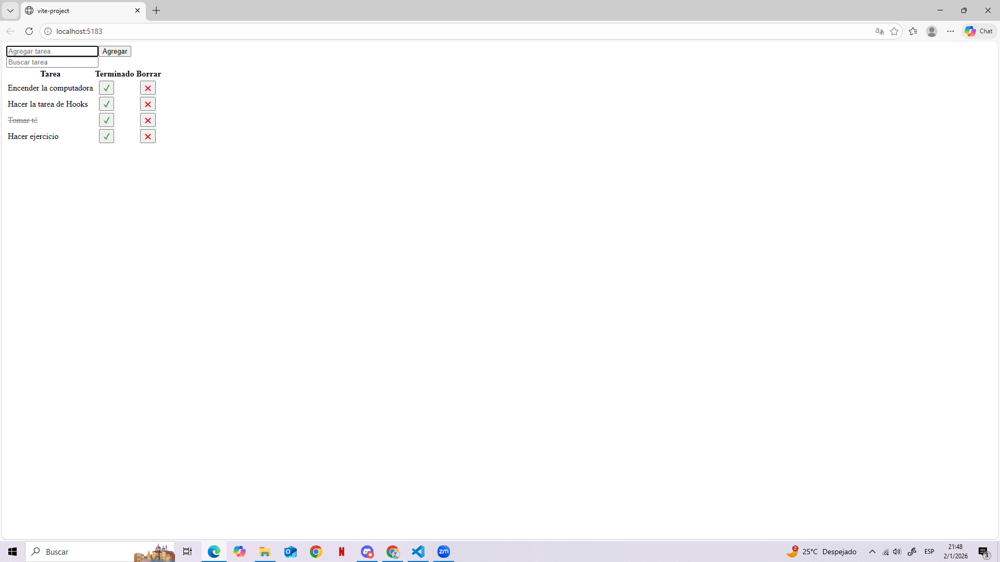

# React + Vite

# TAREA 5
Creación de una lista con jsx donde se pueden agregar tareas o borrarlas, cada una cuenta con su filtro de busqueda y decorado.
Se usó Vite + React, con un LocalStorage y formatos como useState, useEffect, useRef, useMemo.

## Estructura del Proyecto
- `index.html`  
- `app.css` → Estilos css. 
- `main.jsx` → root de la pagina.
- `useLocalStorage.js` → Donde se guardan los datos
- `App.jsx` → Contenido de la lista, mas sus acciones

## Instrucciones para clonar el repositorio
1. Descargar o clonar el repositorio 
git clone https://github.com/andreacastillo2022-gif/tarea5-utn.git
2. ingresar a la carpeta
    cd tarea5-utn
3. Ejecutar la tarea: una vez en la terminal, ingresar npm install para que se instalen los componentes faltantes de Vite y luego npm run dev para que se cree la ruta de la pagina. Luego, ctrl + click para ingresar a ella.

## capturas de pantalla
Captura1: pagina con las listas completadas
Captura2: pagina con filtro de lista

# Andrea Agustina Castillo
# Curso: Curso de Desarrollo en React JS
# Año: 2025

Bibliografia y recursos:
https://www.youtube.com/watch?v=sjrK6RA65eQ
https://react.dev/reference/react/useState
https://react.dev/reference/react/useEffect
https://react.dev/learn/reusing-logic-with-custom-hooks
https://react.dev/learn/reusing-logic-with-custom-hooks
